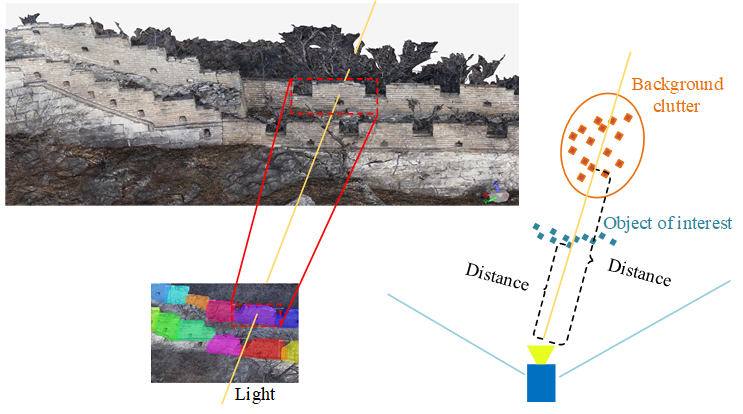
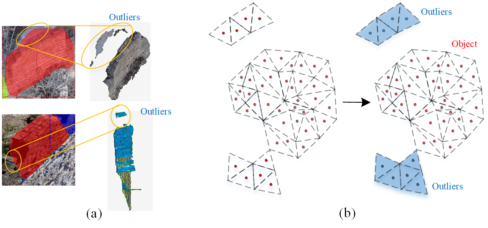
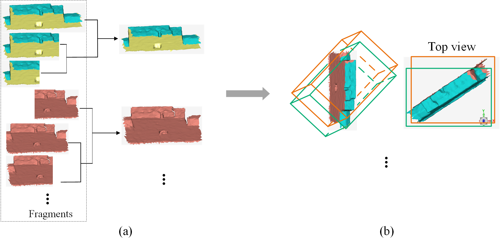

# Deep Neural Networks for Quantitative Damage Evaluation of Building Losses Using Aerial Oblique Images: Case Study on the Great Wall (China)

In this paper, we propose a method for quantitative damage evaluation of large heritage buildings in wild areas with repetitive structures based on drone images. Unlike existing methods that focus on building surfaces, we study the damage of building components and extract hidden linear symmetry information, which is useful for localizing missing parts in architectural restoration.

There are three stages in our approach:
1. Building reconstruction based on the photogrammetric method using high-resolution oblique images captured by drone.
2. 3D object segmentation from the mesh model by projecting each triangle to the oblique images. Advanced deep learning methods are applied to generate 2D objects.
3. Damage estimation of each object by calculating the volume reduction. To obtain the damage condition of an entire building, we define the damage degree in three levels: no or slight damage, moderate damage and severe damage, and then collect statistics on the number of damaged objects at each level.
4. Localization of missing objects through the analysis of the building structure. The symmetry information is detected from the remaining damaged objects and used to localize the positions of missing objects. 

# This is an implementation of the stage II: 3D object segmentation, which consists of three steps: 

1) Assign category information and instance id to each triangle

  Based on the correspondence between oblique images and the 3D mesh model, we reproject each triangle to the oblique images to obtain the category information and instance id.   As shown in the following image, the light from the camera center passes through the foreground and background triangles at the same time. Therefore, there will be several triangles reprojected onto the same oblique image and overlap to each other. To eliminate the background clutter, we compare the distances between the camera center and the triangle, and preserve the one with the shortest distance. 
  

2) In addition to the invisible background clutter, there may be some visible outliers coming from neighboring objects or the surrounding area, which are separated from the object in 3D space and generally have fewer triangles than the object.  Here, we simply remove the visible noise through the analysis of spatial connectivity.

3) 3D object fragments from multiple views are integrated to build complete individual objects according to the geometric features. Object fragments projected from oblique images with different views are different parts of objects. To obtain the complete 3D object, we integrate fragments belonging to the same object with the benefit of the overlap of triangles and 3D bounding boxes.

# The training_dataset and segmentation results
Traning dataset:

2D segmentation results

3D segmentation results

@article{gong2021deep,
  title={Deep Neural Networks for Quantitative Damage Evaluation of Building Losses Using Aerial Oblique Images: Case Study on the Great Wall (China)},
  author={Gong, Yiping and Zhang, Fan and Jia, Xiangyang and Huang, Xianfeng and Li, Deren and Mao, Zhu},
  journal={Remote Sensing},
  volume={13},
  number={7},
  pages={1321},
  year={2021},
  publisher={Multidisciplinary Digital Publishing Institute}
}

